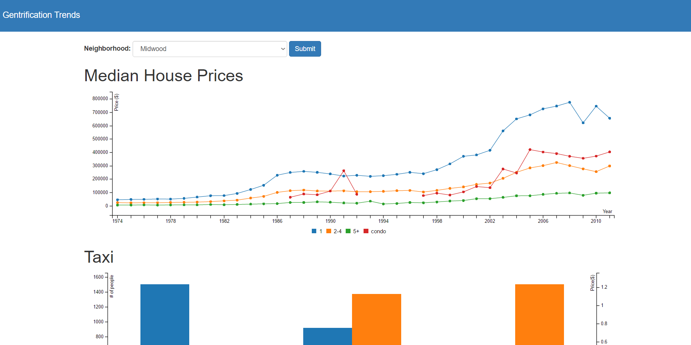

## What is this repository for?

This repository is for Professor Huy Vo's Big Data Management class at the City College of New York. In this repository we've taken various of data in order to create projections of gentrification within New York City. Of course, these are projections and not actual predictions of gentrification, as that would require machine learning and training data, which is outside of the scope of this project.

Data we've used include:
- Yellow Taxi Data (NYC Open Data)
- Crime Rate Data (NYC Open Data)
- Median Housing Data (Furhman Center)

Frameworks/Applications we've used include:
- C3/D3 Js
- Pyspark
- Hadoop
- Flask

## How do I run this repository?

This repository uses **Python 2.7** and requires Flask in order to run the web app. Please install Python **2.7.11** and **pip** package manager.

Install Flask and its dependencies using:

`pip install -r requirements.txt`

### To Run the Server
In your terminal run the command:

`python app.py`

This will run the server on PORT 5000 on your localhost, so please visit that address.

## Using the Web app

When launching the web app, you will be given a dropdown menu. Pick any of the available neighorhoods and click submit to view data within that neighborhood. The user interface
is fairly simple and looks like the following image below.

## Contributors
- [Dong Liang](https://github.com/dongliang3571)
- [Fioger Shahollari](https://github.com/Fioger)
- [Porrith Suong](https://github.com/psuong)
- [Christopher Yang](https://github.com/cyang)
